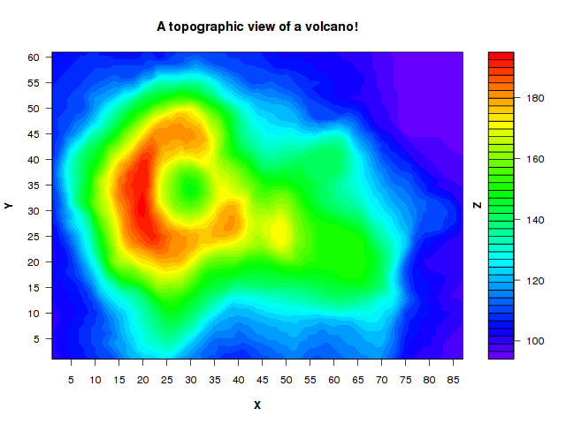

# A picture is worth a 1000 words (and more)

#### Here's a numeric data-set in 3 dimensions.

The first 20 lines in the data are:

```
    84      9       101
    87      25      100
    40      48      138
    44      53      117
    45      52      118
    78      9       105
    31      5       122
    10      9       109
    56      28      151
    53      41      138
    60      25      150
    48      25      170
    64      3       116
    47      32      159
    33      33      158
    4       33      122
    27      11      149
    72      54      97
    78      14      106
    76      56      96
```

<a href="v.shuf.txt">Click here to browse the <b>full</b> data-set</a>

I challenge anyone to try and make sense of it.

- What is this data about?
- Can you detect any patterns?
- Does it make any sense
- Can you find any errors or unlikely outliers in the data?


Looking at the data directly won't get you far.

You may spend a few minutes, hours, maybe even days looking at these 3 numeric columns without gaining any insight.

### What's the point?

The human mind is not good coping with a large number of tiny details.  Most of us, can grasp at most 7 +/-2 items at a time. But not thousands.  This particular data-set has over 5000 lines and over 15,000 numbers in it.

#### But what if we could turn this data into a picture?

Since this data-set has 3 numeric columns, it would be natural to map each column into one dimension in 3D space: (x, y, z).

#### Here's that picture [scroll down to see it]:

<br>
<br>
<br>
<br>
<br>
<br>
<br>
<br>
<br>
<br>
<br>
<br>
<br>
<br>
<br>
<br>
<br>
<br>
<br>
<br>
<br>
<br>
<br>
<br>
<br>
<br>
<br>
<br>
<br>
<br>
<br>

-----



*Maunga Whau (Mt Eden) is one of about 50 volcanos in the Auckland, New Zealand, volcanic field. This data set gives topographic information for Maunga Whau on a 10m by 10m grid.*

\[Credit: Ross Ihaka\]

To generate the chart from [the data](v.shuf.csv) you may use [the `xyz` program](https://raw.githubusercontent.com/arielf/scripts/master/xyz) from [my scripts repository](https://github.com/arielf/scripts/)

With the data in one picture, it becomes immediately obvious what the data is about.  It is a topographical (from above) view of an oval shaped volcano, with uneven crater wall-heights. The highest point is on the left side of the crater. The volcano has 3 ridges sloping down on the lower-end side, the crater is on the left side, a small local peak (in yellow) can be seen to the right of the crater... etc.

We now see so many details, and can go on describing them.

We can even memorize the picture in our minds and reproduce it pretty closely from memory later.


#### Now, what if someone messed with our data?

Let's continue with another, related, exercise.

Change the z-value (3rd column) of just 5 (out of over 5,000) points to some arbitrary value taken from somewhere else in the data-set.  It would be extremely hard to notice this small change by looking at the numbers directly.  But in the picture, our small messing-up with the data stands-out immediately.

-----

\[scroll down to see the tampered-with picture\]

<br>
<br>
<br>
<br>
<br>
<br>
<br>
<br>
<br>
<br>
<br>
<br>
<br>
<br>
<br>
<br>
<br>
<br>
<br>
<br>
<br>
<br>
<br>
<br>
<br>
<br>
<br>
<br>
<br>
<br>
<br>
<br>
<br>
<br>
<br>
<br>
<br>
<br>
<br>
<br>
<br>
<br>
<br>
<br>
<br>
<br>
<br>
<br>
<br>

-----

The bad data shows as a vertical blue line where it isn't supposed to be:
 in the middle of the smooth green area on the lower right-hand slope of the volcano:


-----

The picture allows us, not just to grasp the whole data set in the blink of an eye, but also to notice a tiny case of tampering. The importance of visualization in making sense of data cannot be overstated.

Billions of years of evolution have made us very good in making sense of pictures.  In contrast, we have spent just a few thousands years (human history), making sense of writing, numbers, and data. 

Complex models have their place, but 'debugging' them, and fully understanding them is another matter. Simple, direct rendering and visualization of data is often the best data insight/debugger known to me. I hope that this example has convinced you of this fact too.


-----

-- ariel


